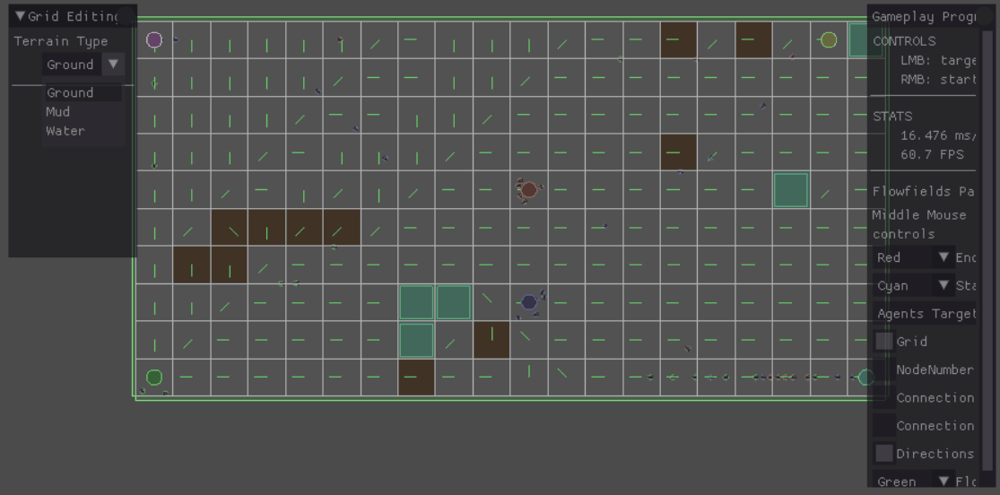

# Flow Fields
## What are flow fields
The term flow fields is used for both physics and pathfinding. In physics it is the distribution of the density and velocity of a fluid over space and time. While in pathfinding it is used to guide crowds to a goal. They can also be called vector fields since each node points, with a vector, towards their neighbor node that is closest to the goal node. When a unit moves over the node they are given the vector that this node has and this is used to influence the velocity of the agent. This field also takes into account obstacles and checks if it flows through it or flows around the obstacle like water.
## Implementation
FlowFields are calculated in three steps:
1. Calculate the cost for all nodes or positions
2. Calculate an integration field which uses the cost
3. Generate the flow field from the integration field

### Calculating the cost field

Every node in the cost field has a value and depending on the terrain this value is set to a small value if passable or a big value if the terrain can't be traversed. So the value given to normal ground is 1 and if the ground is more difficult to traverse like mud or uneven terrain the value is set to a larger value in my case 3.
Since the other 2 fields are dependent on this field they have to be recalculated every time the cost field is updated.
### Calculating the integration field

In order to create an integration field I used the breath first search starting from the target node. This is done in the following steps:
1. Reset the all the values of the integration field to a big value.
2. The goal node gets its value set to 0 since you don't want to move from there and add it to the open list.
3. The current node is set equal to the first value in the open list and gets removed from the open list.
4. Next all the neighboring nodes get their integration value set to the current node's integration value plus their cost.
This only happens if the new calculated cost is less than the old integration value. If the value is to larger than the value set for terrain that can't be traversed it gets ignored.
5. If neighboring node isn't in the open list nor in the closed list you add it to the open list and add the current node to the closed list.
6. Repeat until the open list is empty.

After this you can start calculating the directions of every nod in the flow field.

### Calculating the flow field

Finally, the direction for the vectors in the flow field can be calculated by going over all the neighbors and comparing the cells value theirs find the lowest value.
Using the index of the neighbor you calculate the vector from the node position to the indexed neighbor position
If the target is unreachable the vector is set to the zero vector.

### Using the flow field

Now that there is a fully made flow field it can be used to guide a mass of units along the grid by getting the direction of the flow field at the units position and multiplying it with the unit speed.
## Result

## Conclusion
The flow field pathfinding algorithm is very useful when a lot of units need to go to the same point since it doesn't take into account the agent position. This also means that when all the units are close to the endpoint the field calculates more pathing than needed. The calculation speed is not influenced by the amount of units moving around while it is influenced by the amount of nodes it has to give a vector. So the algorithm is best used the amount of units is considerably large compared to the number of nodes.
